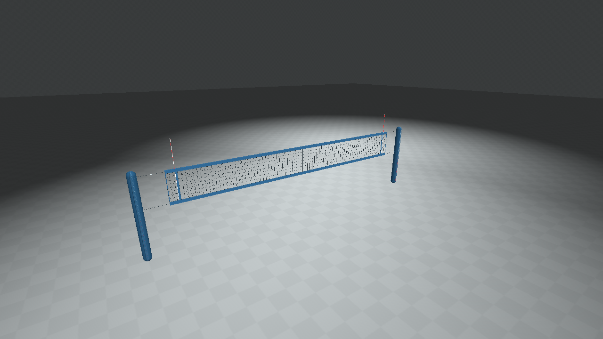
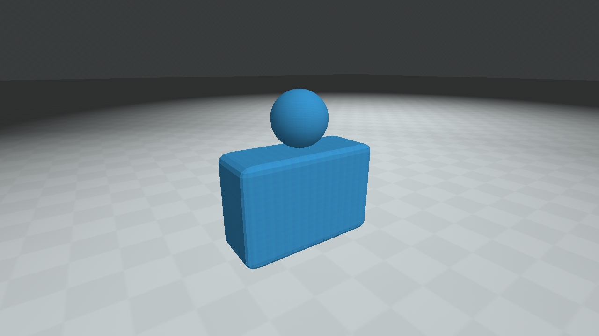

# md3harness

An MD3 authoring and review toolkit for **QSS-M**. Build meshes in Blender or Python, validate the exported binary, then inspect the actual result in Quake.

It grew out of building the animated beach volleyball net in [quake-beach-volleyball](https://github.com/timbergeron/quake-beach-volleyball). The useful lessons are now shared tools: preserve seams and normals, respect the MD3 grid, test every pose, protect atlas colors at distance, and verify the exact asset in its target renderer.



## What it does

- Deterministic MD3 v15 export with automatic surface splitting at the vertex **and** triangle limits.
- Packed-frame selection/repetition and fixed-topology batch joining for long animations, without re-encoding geometry.
- A Blender 4.5 exporter for evaluated meshes, modifiers, sampled animation, material assignments, hard normals, UV seams and `tag_` empties.
- Binary checks for layout, offsets, indices, limits, every pose's bounds/radius, collapsed faces, winding, attachment transforms and safe shader paths.
- Asset contracts for dimensions, static parts, pose counts, triangle budgets and atlas protection at a specified mip level.
- Texture presence, dimensions and hashes, plus machine-readable quality reports.
- An isolated QSS-M studio: front, back, quarter and detail captures, additional animation poses, an offline HTML review and a live camera/animation mode.
- An original, reproducible 37-pose beach net and a Blender fixture that exercise the pipeline.
- A [389-pose character production case study](docs/character-animation.md), with folded-joint lessons, playback and first-person framing advice, and actual QSS-M render evidence.
- A [402-pose anatomical hand case study](docs/anatomical-hands.md), covering palm orientation, finger deformation, cropped forearms, skin UVs, bounded exports and first-person QSS-M captures.

The core uses **Python 3.10+ and the standard library**. Blender and Quake tools are optional until you need their respective export/preview paths. No Quake game data or external executables are included.

## Quick start

From this checkout:

```bash
python3 -m unittest discover -s tests -v
python3 examples/beach_net.py --output build/net
python3 -m md3harness check build/net/progs/bv_net.md3 \
  --asset-root build/net --manifest examples/net.contract.json \
  --strict --json build/net-quality.json
```

For the installed command, `python3 -m pip install -e .` adds `md3harness`. The examples and Blender scripts live in the source checkout.

`check` returns a nonzero exit code for errors; `--strict` also fails on review warnings. Supply the **game root** with `--asset-root`: the shader `progs/bv_net` resolves to `GAME_ROOT/progs/bv_net.tga` or `.png`. A report without an asset root explicitly marks textures unchecked.

## Blender workflow

Set each material's custom property `md3_shader` to its texture path, such as `progs/prop_canvas`. Put the baked texture under that game root. Select the meshes and attachment empties you want to export.

```bash
blender my-prop.blend -b --python-exit-code 1 \
  --python tools/blender_export.py -- \
  --output build/prop/progs/my_prop.md3 --asset-root build/prop \
  --start 1 --end 12 --scene-json build/prop/source.scene.json
```

The default is 32 Quake units per metre, multiplied by Blender's scene unit scale. Coordinates are Z up, with **no automatic rotation or recentering**. Use `--units-per-metre` for your game's scale and `--origin-object` for a fixed first-frame export origin. `--shader` overrides all materials; `--all` exports all renderable scene meshes.

MD3 stores sampled vertex poses. Modifiers and rigging are evaluated before export; the mesh topology, UVs, material assignments and transform handedness must remain fixed across the sampled range. Actual UV animation is rejected; numerical drift up to 0.000001 is tolerated. A failed quality check leaves the previous MD3 intact.

Try the included studio fixture:

```bash
blender -b --factory-startup --python-exit-code 1 \
  --python tools/blender_fixture.py -- --output build/blender
blender -b build/blender/studio.blend --python-exit-code 1 \
  --python tools/blender_export.py -- \
  --output build/blender/progs/studio.md3 --asset-root build/blender \
  --start 1 --end 3
blender -b build/blender/studio.blend --python-exit-code 1 \
  --python tools/blender_checks.py
```



## Review in QSS-M

Supply your QSS-M executable, licensed Quake installation, FTEQCC and ericw's map tools:

```bash
python3 -m md3harness preview build/net/progs/bv_net.md3 \
  --asset-root build/net --output build/review-net --frames 0,2,8 \
  --engine /path/to/quakespasm --basedir /path/to/quake \
  --fteqcc /path/to/fteqcc --qbsp /path/to/qbsp \
  --vis /path/to/vis --light /path/to/light
```

Open `build/review-net/index.html` to compare captures. Additional poses use the quarter view. Each capture is compared with the same view with models hidden; an empty studio fails. The output must be empty so a previous screenshot cannot count as a new result. Reports record the engine, model, textures, preview QuakeC and BSP hashes, and remain incomplete if a capture fails.

For live inspection on a desktop, launch:

```bash
/path/to/quakespasm -basedir "$PWD/build/review-net/runtime" \
  -game md3review -nohome +exec studio-live.cfg
```

Move with your Quake movement controls. In the console, `set harness_frame 8` selects a pose, `set harness_animate 1` cycles the poses, and `set harness_fps 10` sets the sample rate. Automatic captures use a fixed timestep and software OpenGL for repeatability. Your Quake install is only read; the harness keeps maps, configs and screenshots in the review directory.

## Quality scope

Passing structural checks is a starting point for an art review. Judge silhouette, texel density, shading, animation and readability in the target game, especially at playing distance. MD3 has a 1/64-unit position grid and a signed coordinate range of -512 through 511.984375 units. The exporter rejects damage rather than deleting collapsed faces.

This release targets QSS-M's MD3 rendering conventions; it does not claim tested Quake III compatibility. Texture checks inspect headers and package presence, not complete PNG/RLE decoding or baked lighting quality. Atlas guards are conservative footprint checks; visual review is still necessary. Attachment tags are preserved and validated, while live tag visualization/attachment behavior requires your game code. Collision, PBR materials, baking and LOD generation belong to the asset/game pipeline.

See [the production workflow](docs/workflow.md), [scene/contract formats](docs/formats.md), [validation evidence](docs/validation.md) and [source credits](THIRD_PARTY.md). GPL-2.0-or-later.
