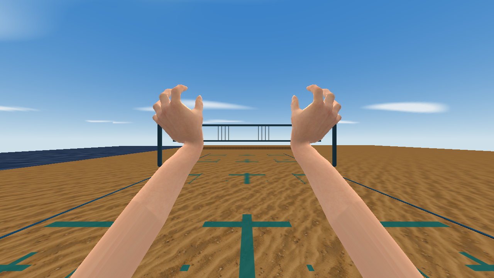

# Lessons from anatomical first-person hands

The [first-person hand build](https://github.com/timbergeron/quake-beach-volleyball/commit/14b88be45b47213390830268c499e7a97b358cca)
replaced the procedural arm model with continuous anatomical hands, three-joint
fingers, opposed thumbs and a 512×2048 skin atlas. Its 32 clips cover deep-dish
setting, firm-palm float serves, inward and wrist-away cuts, and the game's
other volleyball movements. The final MD3 has 402 poses and 6,808 triangles.
All exported poses passed strict checks with the texture present.



The game repository retains the [source extraction](https://github.com/timbergeron/quake-beach-volleyball/blob/14b88be45b47213390830268c499e7a97b358cca/prepare_hand_source.py),
[rig and animation generator](https://github.com/timbergeron/quake-beach-volleyball/blob/14b88be45b47213390830268c499e7a97b358cca/hand_assets.py),
[motion review](https://github.com/timbergeron/quake-beach-volleyball/blob/14b88be45b47213390830268c499e7a97b358cca/hand_review.py)
and [engine capture fixture](https://github.com/timbergeron/quake-beach-volleyball/blob/14b88be45b47213390830268c499e7a97b358cca/hand_view.py).
The mesh, weights, anatomical target and skin are trimmed, pinned CC0 MakeHuman
assets; the skinning and motions are original game code. See the game's source
credits and [this repository's credits](../THIRD_PARTY.md).

## Name the palm and dorsal axes explicitly

A finger-longitudinal axis and an axis toward the thumb do not alone establish
which side is the palm. On the extracted left hand, their cross product pointed
toward the palm. The authoring basis instead uses the negative cross product for
the dorsal Z axis and reverses the source faces to match that change of handedness.
Finger flexion then moves toward negative Z, into the palm. A nail landmark and
the contact palm directions guard this convention in the game's tests.

Reflecting a hand for the opposite side also changes triangle winding. Reflect
positions and normals, reverse the reflected source faces, and check that each
thumb is on the medial side. A valid binary with incorrectly oriented hands can
still put a player's nails against the ball.

## Solve detail at the exported grid, before skinning

The source mesh has nail bevels smaller than the MD3 grid. At this game's scale,
1/64 of a unit is about 0.49 mm. Those details could collapse when fingers curled,
even after a convincing source render. The source extraction welds small bevels
before skinning, averaging positions and bone weights while retaining UV seam
corners. It rejects the resulting zero-area source faces explicitly; the harness
continues to reject collapsed exported triangles rather than silently deleting
them.

Dual quaternion skinning preserved finger and wrist volume better than the
initial linear blend. It still needed crease normals derived from the deformed
faces. Keep a consistent split-corner layout for every sample. Compare those
normals against the face produced by the actual 1/64-unit position conversion
and the decoded eight-bit normal angles. Correct an offending crease normal in
the authoring code; do not weaken the winding check or use normals to conceal
an inverted surface.

The game's regression exports both hands through 13 ready, loaded, contact and
transition samples, including the previously failing wrist fold. It also checks
thumb placement and palm direction. These anatomical tests remain with that
rig; this toolkit supplies format and quality checks.

## Extend cropped forearms along their own axis

Whole-face cropping left a jagged attachment ring. Extending it toward a fixed
point below the camera then produced a false elbow knot in first-person play.
Both candidates passed structural checks: a validator cannot decide whether a
forearm looks anatomical.

The extraction now clips crossing polygons against one forearm plane. Shared
edge intersections interpolate skin weights and UVs and form a clean ring.
The game extends that ring along the anatomical forearm axis for 35 units,
using four continuation rings whose ends stay outside the camera. This avoids
changing the forearm direction abruptly just to hide its cropped end.

Keeping the same boundary UV down the entire extension made skin colors look
like long wood grain. A padded 512×224 strip in the unused atlas gutter now unwraps
the forearm circumference across U and its length across V. Its first row matches
the boundary skin samples; later rows blend into nearby real forearm skin.
Review that transition in the native renderer, including palms facing the camera.

## Export long pose libraries in bounded batches

Normalizing and partitioning all 402 detailed samples at once used too much
memory on the production machine. The generator stores source vectors in
`array('f')`, caches immutable poses, and exports at most 80 frames at a time.
Exact repeated position/normal arrays within a batch reuse an exported pose;
this uses identity of immutable cached data, with no approximate pose matching.
The animation's full labels and frame timing remain intact.

The reusable byte operations are now in `md3harness.packed`:

```python
from pathlib import Path
from md3harness.packed import combine_batches, expand_frames
from md3harness.quality import inspect

# The compact export has already passed strict source/texture checks.
compact = Path("build/compact.md3").read_bytes()
expanded = expand_frames(compact, [0, 1, 1, 0], ["rest", "load", "held", "return"])
Path("build/batch0.md3").write_bytes(expanded)

candidate = Path("build/candidate.md3")
candidate.write_bytes(combine_batches(Path(p).read_bytes() for p in batch_paths))
report = inspect(candidate, asset_root=game_root, manifest={"frames": expected_frames})
if not report["passed"] or report["issues"]:
    raise ValueError(report["issues"])
candidate.replace(final_path)
```

`expand_frames` selects, reorders or repeats complete packed samples, retaining
their bounds, tags, normals and vertex bytes while assigning frame labels.
`combine_batches` requires the same model/surface metadata, triangle indices,
shaders, UVs and attachment names/order. Both validate binary ranges and obey
the 1,024-frame limit. They accept valid alternative block layouts and return
canonical layout bytes. Neither operation replaces the full geometry, texture
and contract check. Write to a candidate and preserve the previous asset until
that check passes.

These helpers avoid a second source-vector export; they are not a fully streaming
writer. Budget for the input/output packed bytes and validator too. The small core
regressions compare multi-surface, animated-tag results byte-for-byte with a
direct export and exercise invalid inputs. The [production check](evidence/hands/packed-verification.json)
also compares joined and expanded real hand batches against the delivered bytes.

## Review the first-person view and the live stroke separately

The [engine gallery](evidence/hands/index.html) includes ready, setting load and
release, float toss and contact, and both cut directions. These are actual
QSS-M captures at the final camera and model frames, rather than browser renders.
The [capture metadata](evidence/hands/review.json) records model, skin, engine,
frame and screenshot hashes. The model's [strict quality report](evidence/hands/hands.report.json)
covers all 402 samples. The captures do not claim paired empty-studio baselines.

The game's offline motion reviewer embeds the exact MD3, texture and clip
manifest. It supports playback, scrubbing, slow motion, the 90° horizontal
first-person camera, and an orbiting detail view. For a 55 MB embedded model,
decode base64 into a preallocated typed array with a loop: constructing a boxed
intermediate array substantially increases browser memory use.

The first 389 frames retain the body ranges; 13 wrist-away samples are appended.
The cut-away engine capture uses frame 392, confirming native extended-frame
view-model playback. Source sampling remains 24 Hz; live updates use the target
renderer's 0.1-second alias interpolation cadence. Gameplay captures then check
the real serve contact and receive/set/attack flow. The [QC verification summaries](evidence/hands/gameplay.json)
record 257 gameplay assertions, three live serve checks, and two live rally checks.
Frozen visual fixtures alone do not establish contact timing or clip selection.

Keep engine fixtures isolated and disabled in normal play. After revising anatomy,
UVs or skinning, repeat the peak and intermediate poses in the target renderer.
The cropped-ring and stretched-skin failures are concrete examples of problems
that strict math checks left for visual review.
